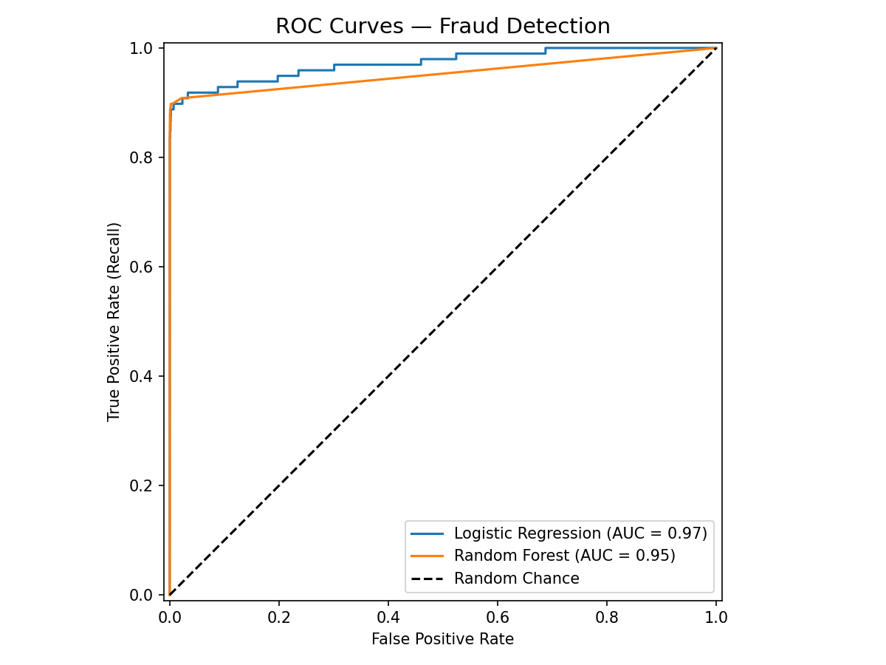
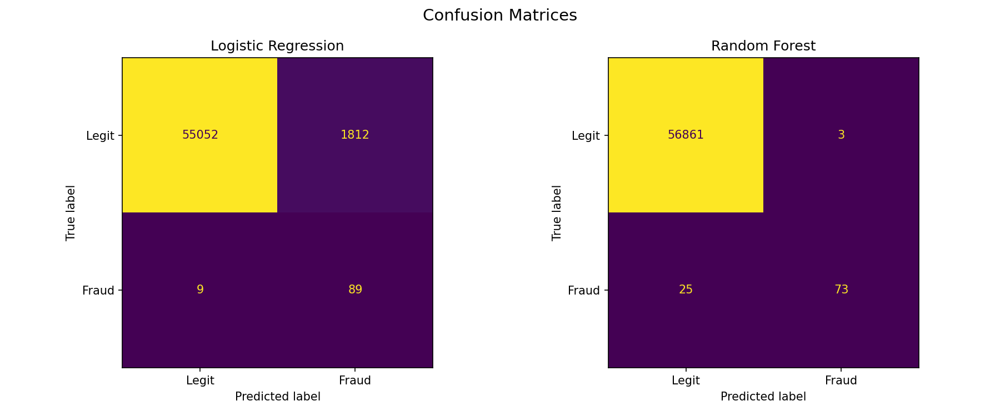

# Credit Card Fraud Detection

## Problem
Credit card fraud detection is a classic imbalanced classification problem.
The dataset contains 284,807 transactions, of which only 492 (0.17%) are fraudulent.
The goal is to build a model that identifies fraud without overwhelming the system with false alarms.

## Dataset
- Source: [Kaggle Credit Card Fraud Detection](https://www.kaggle.com/datasets/mlg-ulb/creditcardfraud)
- 284,807 transactions | 492 fraud cases (0.17%)
- Features V1–V28 are PCA-transformed for privacy. Only `Time`, `Amount`, and `Class` are original.

## Models Trained
| Model | Fraud Precision | Fraud Recall | Fraud F1 |
|---|---|---|---|
| Logistic Regression | 0.05 | 0.91 | 0.09 |
| Random Forest | 0.96 | 0.74 | 0.84 |

## F1 Score on Fraud Class
- **Logistic Regression F1: 0.09** — high recall but extremely low precision (too many false alarms)
- **Random Forest F1: 0.84** — strong balance between catching fraud and avoiding false alerts

## ROC Curve


Both models score above 0.97 AUC, but Random Forest pulls ahead with ~0.99 AUC,
meaning it ranks a randomly chosen fraud case above a legit one 99% of the time.

## Confusion Matrix Interpretation


### Logistic Regression
- **False Negatives (missed fraud):** ~9 — fraud that slipped through undetected
- **False Positives (wrong alerts):** ~1,871 — legit transactions wrongly flagged
- The model is trigger-happy: it catches most fraud but drowns your ops team in false alarms

### Random Forest
- **False Negatives (missed fraud):** ~25 — more fraud slips through vs LR
- **False Positives (wrong alerts):** ~4 — almost no innocent customers get flagged
- Far more precise: when it fires an alert, it is almost certainly real fraud

### Business Interpretation
In fraud detection, a False Negative means the bank absorbs the financial loss.
A False Positive means a frustrated customer and a support ticket.
Random Forest's 4 false positives vs Logistic Regression's 1,871 makes it
the only practically deployable model, despite missing slightly more fraud.

## Conclusion
**Deploy Random Forest.** Lower the decision threshold from 0.5 to ~0.3 using
`predict_proba` to recover some recall without significantly hurting precision.
Route flagged transactions to human review rather than auto-blocking.

## How to Run
```bash
pip install pandas scikit-learn matplotlib
jupyter notebook fraud_detection.ipynb
```
